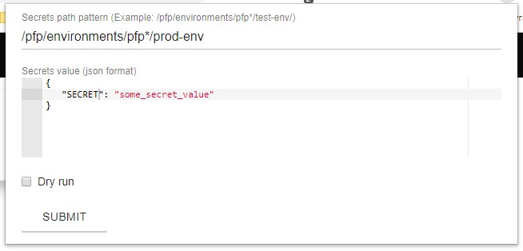

# Purpose

Vault lacks of secrets mass editing through its browser ui. This extension allow to do that by specifying path pattern for secrets that should be updated.

# How To

## Build project
Run `yarn && yarn watch` or `npm i && npm run watch`. This would start `tsc` in watch mode. 

To build once run `yarn build` or `npm run build`.
